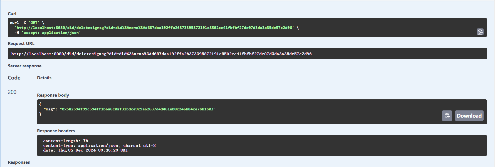

# AirDrop DID Interface

BASE URL http://119.147.213.61:38082/ 

## Get Sig Msg

PATH: /did/createsigmsg

### Method

GET

### Param

| Name      | Type   | Description                         |
| --------- | ------ | ----------------------------------- |
| chain     | string | The chain where the user is located |
| publicKey | string | Public key in wallet                |

### Response

| Name | Type   | Description          |
| ---- | ------ | -------------------- |
| msg  | string | Message to be signed |

### Example

## Create DID

PATH: /did/create

### Method

POST

### Param

| Name | Type   | Description                         |
| ---- | ------ | ----------------------------------- |
| sig  | string | The user signs with the private key |

### Response

| Name | Type   | Description |
| ---- | ------ | ----------- |
| did  | string | user did    |

### Example

## Get DID Info

PATH: /did/info

### Method

GET

### Param

| Name | Type   | Description |
| ---- | ------ | ----------- |
| did  | string | user did    |

### Response

| Name | Type    | Description |
| ---- | ------- | ----------- |
| did  | string  | user did    |
| Info | DIDInfo | did info    |

### example

## Get Delete Msg

### Method

GET

### Param

| Name | Type   | Description |
| ---- | ------ | ----------- |
| did  | string | user did    |

### Response

| Name | Type   | Description          |
| ---- | ------ | -------------------- |
| msg  | string | Message to be signed |

### Example

## Delete DID

### Method

POST

### Param

| Name | Type   | Description                         |
| ---- | ------ | ----------------------------------- |
| sig  | string | The user signs with the private key |
| did  | string | user did                            |

### Response

| Name   | Type | Description |
| ------ | ---- | ----------- |
| status | bool | did status  |

### Example

